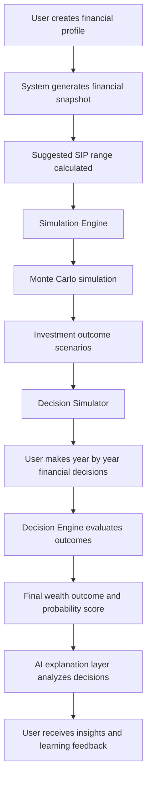

# WorthWise

WorthWise is an interactive financial decision learning platform designed for teens and young adults.  
Instead of learning finance only through theory, users learn by doing through simulations and guided decision making.

The platform helps users understand how everyday financial choices influence long term outcomes.

## Project Goal

Help users practice real world financial decisions such as saving, investing, handling market changes, and planning for long term goals in a safe simulated environment.

By experiencing the consequences of their choices, users build a better understanding of risk, uncertainty, and financial planning.

## Features

- Interactive financial profile setup including income, expenses, and risk preference
- SIP and long term portfolio growth simulation
- Monte Carlo based market simulations to model uncertainty
- Decision timeline where users make financial choices year by year
- AI powered explanations that help users understand the impact of their decisions
- Adaptive learning levels that increase difficulty as users progress
- Live economic dashboard with market indicators
- Integrated financial chatbot for contextual guidance

## Core Modules (Project Scope)

### Financial Profile Setup
Users begin by creating a financial profile that includes income, expenses, savings, and risk preference.

### SIP and Portfolio Growth Simulation
Simulates long term investment growth using uncertain market scenarios to demonstrate how portfolios evolve over time.

### Decision Timeline Simulator
Users make financial decisions year by year and observe how those choices affect future wealth outcomes.

### Adaptive Learning Levels
The platform introduces increasing complexity through learning stages:

- **Explorer**  
  Basic financial concepts with simplified scenarios.

- **Analyst**  
  More realistic market variability and financial trade offs.

- **Strategist**  
  Advanced scenarios with market shocks and complex decisions.

### Reflection and Explanation Layer
An AI assisted explanation layer helps users understand why certain decisions lead to specific financial outcomes, reinforcing learning through reflection.

## System Flow

