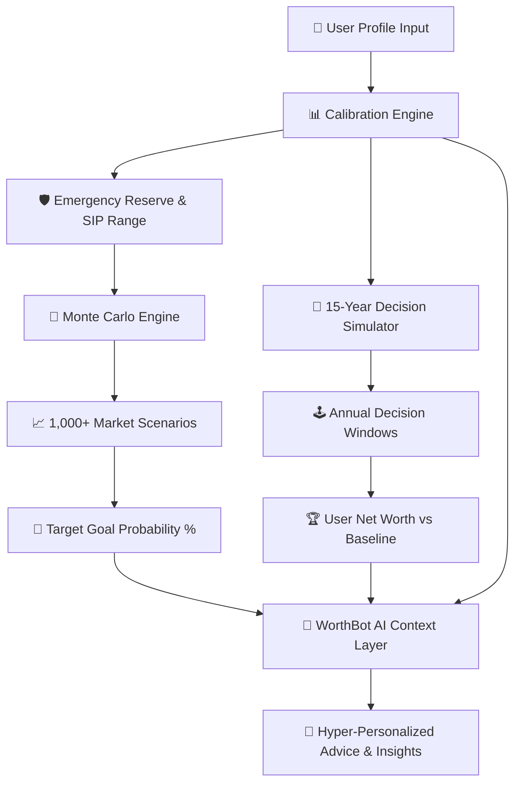

# 💎 WorthWise — Next-Gen AI Financial Decision & Learning Platform

[](https://worthwise-web.onrender.com)
[](https://react.dev/)
[](https://expressjs.com/)
[](https://supabase.com/)
[](https://groq.com/)

> **🌐 Live Production Site:** [https://worthwise-web.onrender.com](https://worthwise-web.onrender.com)  
> **Master Personal Finance by Doing, Not Just Reading.**  
> WorthWise is an interactive, AI-powered financial simulation platform built for Gen-Z, young adults, and novice investors. Learn how real-world financial choices, market shocks, and investment strategies shape long-term wealth through Monte Carlo forecasting, interactive decision gaming, and hyper-personalized Groq AI advice.

---

## 🌟 Key Highlights & Features

| Feature | Description | Key Tech / Engine |
| :--- | :--- | :--- |
| **📊 Financial Calibration Engine** | Calculates live monthly surplus, savings rate %, emergency reserve requirements (6 months), and suggested SIP range. | Custom Financial Engine |
| **🎲 Monte Carlo Engine** | Runs 1,000+ stochastic market simulations modeling $P_{10}$ worst-case, $P_{50}$ expected, and $P_{90}$ best-case wealth outcomes. | Stochastic Algorithmic Engine |
| **🧠 15-Year Decision Simulator** | Interactive turn-based game where users make annual financial choices (Invest, Hold, Withdraw) under market shocks. | Decision Game Engine |
| **🤖 Context-Aware WorthBot** | Ultra-fast AI financial advisor powered by Groq Cloud API. Receives full snapshot, Monte Carlo forecast, and Decision history. | `groq/compound-mini` / `llama-3.1-8b` |
| **🔒 Supabase Auth & Security** | Full Supabase Authentication integration for live user login, signup, password resets, and session management. | Supabase JS v2 |
| **📈 Live Economic Dashboard** | Real-time forex rates (USD/INR, EUR/INR), inflation metrics, repo rates, and mutual fund NAV updates. | Live Market Feed |

---

## 🏗️ Architecture & System Flow


```mermaid
flowchart TD
    A[👤 User Profile Input] --> B[📊 Calibration Engine]
    B --> C[🛡️ Emergency Reserve & SIP Range]
    C --> D[🎲 Monte Carlo Engine]
    D --> E[📈 1,000+ Market Scenarios]
    E --> F[🎯 Target Goal Probability %]
    
    B --> G[🧠 15-Year Decision Simulator]
    G --> H[🕹️ Annual Decision Windows]
    H --> I[🏆 User Net Worth vs Baseline]
    
    F & I & B --> J[🤖 WorthBot AI Context Layer]
    J --> K[💬 Hyper-Personalized Advice & Insights]
```

---

## 🛠️ Tech Stack & Key Libraries

### **Frontend**
- **Framework**: React 19 SPA
- **Router**: React Router DOM v7
- **Styling**: Modern Glassmorphism CSS with CSS Custom Variables
- **Visuals & Charts**: GFM Alerts, KaTeX Math Renderer, Custom SVG Graphs

### **Backend & AI**
- **Runtime**: Node.js & Express 5
- **AI Inference Engine**: Groq Cloud API (`groq/compound-mini` & `llama-3.1-8b-instant`)
- **Database & Authentication**: Supabase Cloud Auth & PostgreSQL
- **Security & Validation**: Express Validator, CORS, Rate-Limiting

---

## 🚀 Quick Start & Local Setup

### **Prerequisites**
- Node.js `v18+` or `v20+`
- npm `v9+`

### **1. Clone the Repository**
```bash
git clone https://github.com/hardeeparekh/Capstone-project.git
cd Capstone-project
```

### **2. Frontend Environment Setup**
Create `.env` in the root folder:
```env
REACT_APP_SUPABASE_URL=https://yoghqhcaesogkvorfnei.supabase.co
REACT_APP_SUPABASE_ANON_KEY=sb_publishable_TeiL5frIwQdc1hshpxofxg_TElfjbdV
REACT_APP_API_BASE=http://localhost:5000/api
```

### **3. Backend Environment Setup**
Create `server/.env` in the `server` folder:
```env
PORT=5000
SUPABASE_URL=https://yoghqhcaesogkvorfnei.supabase.co
SUPABASE_ANON_KEY=sb_publishable_TeiL5frIwQdc1hshpxofxg_TElfjbdV
GROQ_API_KEY=your_groq_cloud_api_key
GROQ_MODEL=llama-3.1-8b-instant
```

### **4. Run Locally**
```bash
# Terminal 1: Start Express Backend (Port 5000)
cd server
npm install
npm start

# Terminal 2: Start React Frontend (Port 3000)
npm install
npm start
```
Open [http://localhost:3000](http://localhost:3000) in your browser!

---

## 🌐 Production Deployment (Render)

WorthWise includes a ready-to-use [`render.yaml`](./render.yaml) blueprint configuration for 1-click deployment on **Render**:

- **🌐 Live Production Website**: [https://worthwise-web.onrender.com](https://worthwise-web.onrender.com)
- **⚡ Live Backend API**: [https://worthwise-api.onrender.com](https://worthwise-api.onrender.com)

---

## 📜 License & Credits

Built with ❤️ by **WE Cohort 6 Students** for the Capstone Project.
